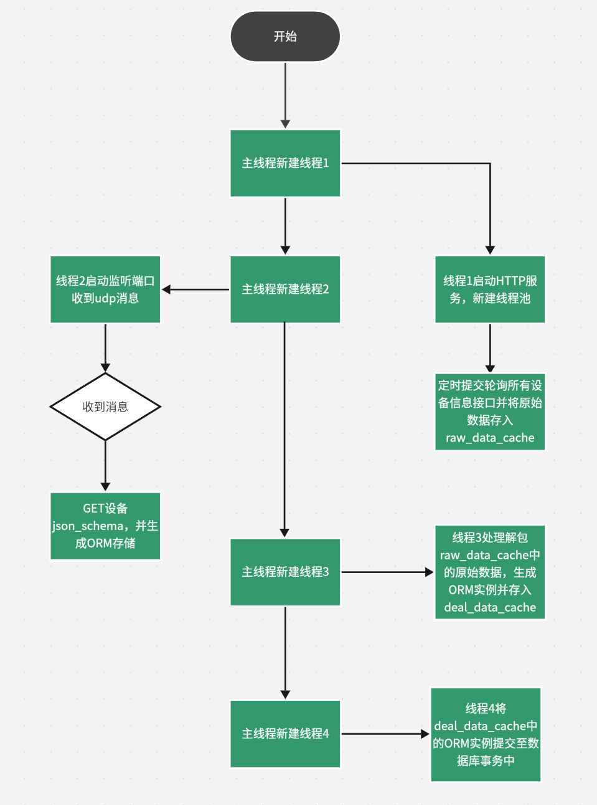

## 1.1 简介
* 该代码主要目的是发现设备，根据设备提供的**json_schema**生成**ORM**，并定时从设备端获取数据存入**sqlite**数据库中。
## 1.2 使用方法
### 1.2.1 部署sqlite
可以参考[linux下sqlite安装及基本使用](https://blog.csdn.net/qq_51368339/article/details/127896474)部署sqlite。
### 1.2.2 python库安装
* 使用以下命令安装所需要的库。
```
pip install Flask
pip install opencv-python
pip install jsonschema
pip install SQLAlchemy
pip install argparse
```
### 1.2.3 模拟机器人代码使用
* 运行以下命令来启动程序：
```
python3 robot_simulation.py --port 8081 --hostname robot_1
```
* 其中**8081**及**robot_1**修改为你所需要的端口及机器人名字
* 默认是在本地**127.0.0.1**部署，如果有需要修改**robot_simulation.py**文件中的
```
28 message = f"UDP PORT:{args.port} hostname:{args.hostname} IP:127.0.0.1"
```
* **IP**修改为当前**IP**
```
35 app.run(host='0.0.0.0', port=args.port, threaded=True)  # 使用多线程模式
```
* **host**修改为当前**IP**
```
233  target_host = "localhost"
234  target_port = 12345
```
* 修改为**server**用于设备发现监听的端口及**server**的**IP**
### 1.2.4 批量启动模拟机器人
* 使用提供的**start_robot_simulation.py**代码，运行以下命令来启动程序：
```
python3 '/your/path/to/start_robot_simulation.py' 
```
* 注意！如果报错，可以尝试使用以下命令启动
```
/usr/bin/python3.8 '/your/path/to/start_robot_simulation.py' 
```
* 如果需要修改启动机器人的数量，修改**start_robot_simulation.py**中的
```
13 num_robots = 100
```
* 修改该变量的值为你期望的机器人数量即可
### 1.2.5 启动server
* 使用提供的**server.py**代码
* 运行以下命令来启动程序：
```
python3 server.py
```
* **server**默认监听来自**127.0.0.1：12345**的**UDP**消息用于发现设备，如有需要请修改
```
26 udp_socket.bind(('localhost', 12345))
```
* 为你要监听的**IP**与端口
* **server**默认设备提供**json_schema**的路径为
```
52 url = f"{address}/data_discovery"
```
* **server**默认**IP**为
```
299 app.run(host='0.0.0.0', port=8080)
```
* 可以根据需要自行修改
## 1.3 http接口说明
### 1.3.1 模拟机器人接口
* 以下为模拟机器人接口。
```
99 @app.route('/data_discovery')
```
  接口描述：为**server**提供**json_schema**
  下面给出示例**json_schema**
```
schemas = [{
        "API": {
        "address": f"http://127.0.0.1:{args.port}/api/move",
        "protocol": "REST",
        "method": "GET"
    },
    "schema": {
    "$schema": "http://json-schema.org/draft-07/schema#",
    "type": "object",
    "properties": {
        "Location": {
            "type": "object",
            "properties": {
                "test": {
                    "type": "object",
                    "properties": {
                        "test_msg": {
                            "type": "object",
                            "properties": {
                                "test_t": {
                                    "type": "integer"
                                }
                            },
                            "required": [
                                "test_t"
                            ]
                        },
                        "timestamp1": {
                            "type": "string"
                        }
                    },
                    "required": [
                        "test_msg",
                        "timestamp1"
                    ]
                },
                "timestamp": {
                    "type": "string"
                },
                "x": {
                    "type": "number"
                },
                "y": {
                    "type": "number"
                },
                "z": {
                    "type": "number"
                }
            },
            "required": [
                "test",
                "timestamp",
                "x",
                "y",
                "z"
            ]
        }
    },
    "required": [
        "Location"
    ]
}
}]
```
* 事实上提供的是一个列表，提供所有接口的**API**及**json_schema**，**API**项中的每个项都不可缺失，目前**json_schema**的选项支支持以上格式及类型（**array**也支持），但不应该出现其他键
* 之后只需要根据你向服务器提供的**API**提供相应的服务即可
### 1.3.2 server 接口
* 以下为**server**接口。
```
288 @app.route('/udp_message')
```
接口描述：接收来自设备的**UDP**消息，用于设备发现
* 下面提供设备应该向服务器提供的**UDP**消息
```
28 message = f"UDP PORT:{args.port} hostname:{args.hostname} IP:127.0.0.1"
```
* 客户端应保证**PORT**项及**IP**项可以正确访问到该设备
<br/>
<br/>
```
338 @app.route('/interest_topic', methods=['POST'])
```
接口描述：接收来自设备的**HTTP**消息，用于订阅及设置获取频率
* 下面给出消息示例：
```
    {
        "interest": [
            {
                "host_name": "robot_1",
                "interest_topic": [{"topic" : "Location","cycle" : "2"}]
            }
        ]
    }
```
* 其中**cycle**单位为**second**，表示轮询周期
## 2.1 程序流程
### 2.1.1 模拟机器人程序运行流程
* 下面是模拟机器人运行流程图。
### 2.1.2 server程序运行流程
* 下面是**server**运行流程图。
### 2.1.3 性能测试
* 通过提供的**start_robot_simulation.py**、**robot_simulation.py**、**server.py**代码测试，**server**平均访问并存储速度为82API ps。